# Garden Escape: Honey I Shrunk the Coder!

Garden Escape: Honey I Shrunk the Coder! is a fun choose-your-own adventure story game where you play the role of a tiny software developer who has to make a series of key decisions to choose the direction of the narrative and try to survive until the end of the story.

Can you fight your way through your jungle-sized garden, past giant creepy crawlies and garden tools back to the safety of your kitchen? Choose from the options presented to you as you progress through the story and follow the prompts on screen to see if you can make it home and escape the garden.

The story includes references that will appeal to developers, but is equally fun and easy to understand if you have no coding experience at all.

This terminal-based project is coded in Python and is designed to view on a laptop / desktop computer screen. It will not display correctly on a mobile.

The live site can be found here: https://garden-escape-185db543c454.herokuapp.com/

***CHEAT SHEET***

If you get stuck or wish to run through the story to reach the end to test the functionality then the sequence of correct choices is listed at the end of this document.

## Features

### Game Title (title.py)

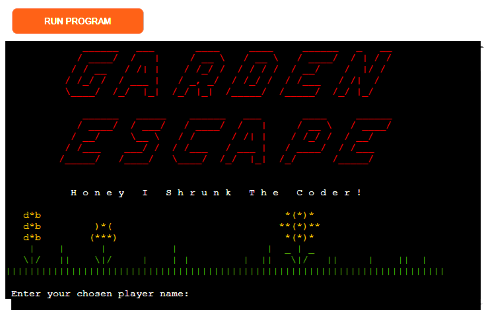

***Title Text***

- 'Garden Escape' displayed in large text to provide clear heading to mark the beginning of the story and to give an impression of a big adventure ahead. 
- Colour red used to indicate danger and risk
- 'Honey I Shrunk the Coder!' in default font, but with spacing between letters to stand out from regular text and appear larger to work visually alongside main title text.
- 'Garden Escape' text generated using [pyfiglet 1.0.2](https://pypi.org/project/pyfiglet/) library imported from Python Package Index (PyPI) with ['slant'](http://www.figlet.org/examples.html) font. 
- Red colour text output created using [Colorama 0.4.6](https://pypi.org/project/colorama/) library imported from PyPI.

***ASCII Art***

- A garden themed strip of ASCII art to help set the scene alongside the title text.
- Different coloured output created using Colorama’s constant shorthand for ANSI escape sequences.

***Enter Name: input()***

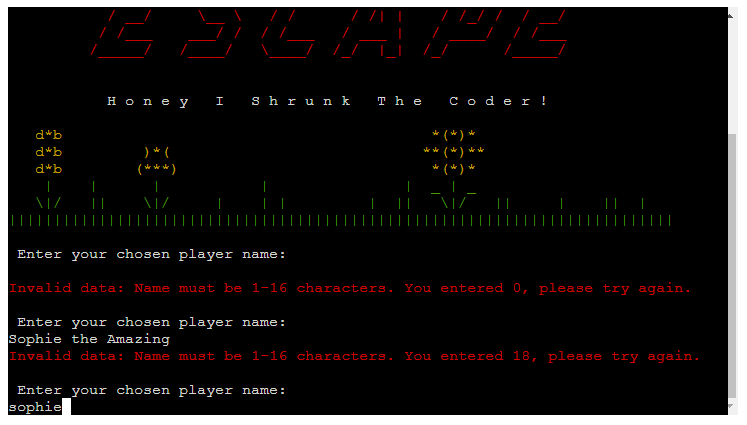

- The player is invited to enter a name for their story character via the get_player_name() function.
- The name must be at least 1 character long, but less than 16 characters so it fits in the final congratulations window at the end of the story.
- The entered name is passed through validation function validate_player_name() and if it does not pass validation then an error message is displayed to the player with a prompt to try again.
- The error message is displayed in red text to highlight that there is problem that needs attention.

### Introduction

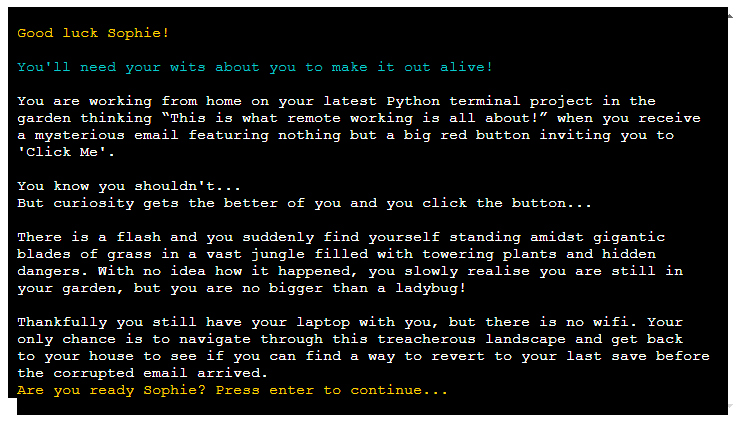

***Good Luck Message***

- An f-string at the top of the intro page displays the message "Good Luck {player}!" which inserts the name entered by the user in place of the {player} placeholder. 
- Feeds back to the user that the name they entered has been logged and provides a more personal interaction with the game.

***Intro Text***

- Introductory text to set the scene for the story, providing context and explaining the aim of the game.
- The start_adventure() function displays the relevant block of narrative text from the story_text.py by drilling down using dot notation to the relevant variable INTRO_TEXT and extracting this content from the file to display in the terminal.

***Start Game: input()***

- At the bottom of the window is a prompt with an f-string displaying "Are you ready {player_name}? Press enter to continue..." which inserts the name entered by the user in place of the {player_name} placeholder.
- This reinforces the connection with the player and builds tension.
- There is no validation for this input as it is not used in any other part of the program

### CHAPTER ONE - Spider Story

***Spider Story and Options Text***

- Narrative text to start the adventure and set the scene for an encounter with a giant spider.
- The display_spider_story() function extracts the SPIDER_STORY_TEXT from story_text.py and displays it on the terminal.
- Two options are displayed for the player to choose from. Each option will determine a different narrative direction for the next part of the story.
- The display_spider_story() function extracts the two options (SPIDER_OPTION_A and SPIDER_OPTION_B) from story_text.py
- The options are displayed to the player in two different colours so they stand out from the usual story text.
- This function runs the display_spider_story_choices() function

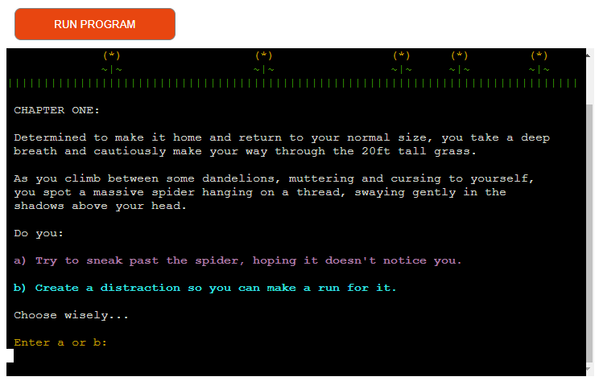

***Display Spider Story Choices***

- The display_spider_story_choices() function gets the story choice from the player and uses an if/else statement to define which code to run and story text to extract from story_text.py according to the choice of a or b made by the player.
-  Both outcomes will run the spider_ascii() function from spider.py which displays the spider ascii art alongside the relevant narrative text for either a or b chosen by the player.
- For both option choices, the progress_prompt() function is imported from progress_prompt.py to ask the player to "Press enter to continue..." when they are ready.
- This function allows the player to move through each 'page' of the story at their own pace and does not require any validation as the input is not used anywhere else.

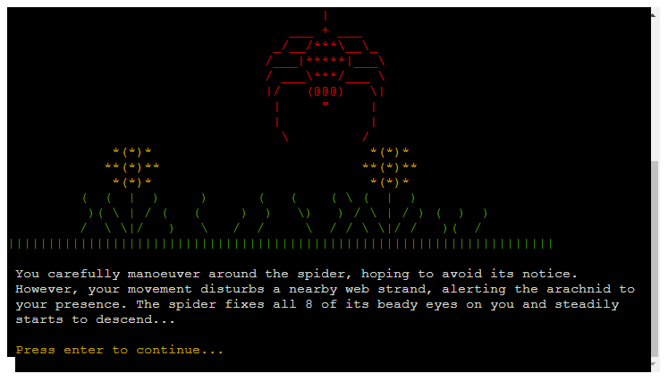

***Nested Spider Options***

- One of the two options in the first spider scenario contains a further set of 'nested' options for the player to choose from to progress the story.
- The display_nested_spider_choices() function extracts the NESTED_SPIDER_OPTIONS_TEXT from story_text.py and displays this on the terminal along with the two nested options a and b for the player to select between.
- Options are displayed to the player in two different colours so they stand out from the usual story text.
- The progress_prompt() function is imported from progress_prompt.py to ask the player to "Press enter to continue..." when they are ready.

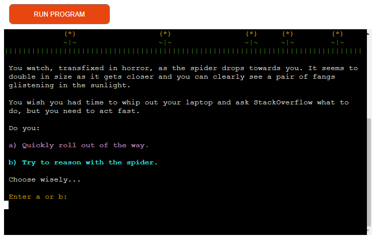

### CHAPTER TWO - Centipede Story

***Centipede Story Text***

- Narrative text to move the story forward from the spider scenario and set the scene for an encounter with an enormous centipede.
- The display_centipede_story() function extracts the CENTIPEDE_STORY_TEXT from story_text.py and displays it on the terminal.
- This function runs the display_centipede_story_choices() function.

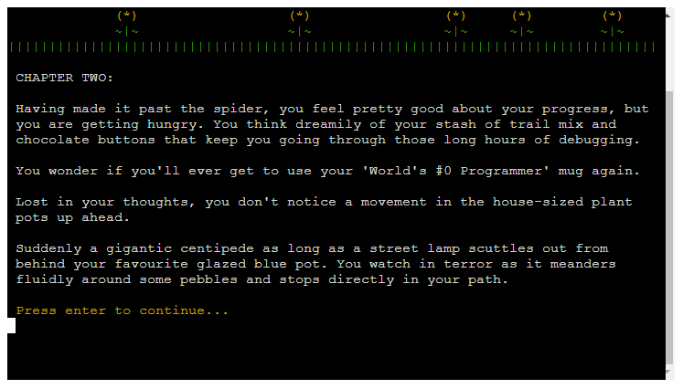
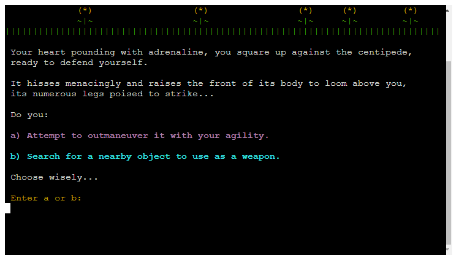

***Display Centipede Story Choices***

- Two options are displayed for the player to choose from. Each option determines a different narrative direction for the next part of the story.
- The display_centipede_story_choices() function extracts the two options (CENTIPEDE_OPTION_A and CENTIPEDE_OPTION_B) from story_text.py and displays them to the player.
- This function then runs the get_story_choice() function to ask the player to choose option a or b.
- An if/else statement defines which code to run and which narrative text variable to extract from story_text.py according to the choice of a or b made by the player.
-  Both outcomes run the centipede_ascii() function from centipede.py which displays the centipede ascii art alongside the relevant narrative text for either a or b chosen by the player.
- For both option choices, the progress_prompt() function is imported from progress_prompt.py to ask the player to "Press enter to continue..." when they are ready.

### Chapter Three - Rake Story

***Rake Story Text***

- Narrative text to move the story forward from the centipede scenario and set the scene for the next obstacle; a massive rake.
- The display_rake_story() function extracts the RAKE_STORY_TEXT from story_text.py and displays it on the terminal.
- This function runs the display_rake_story_choices() function.

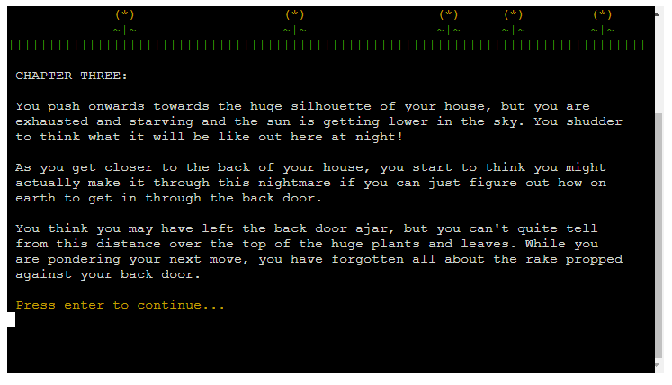
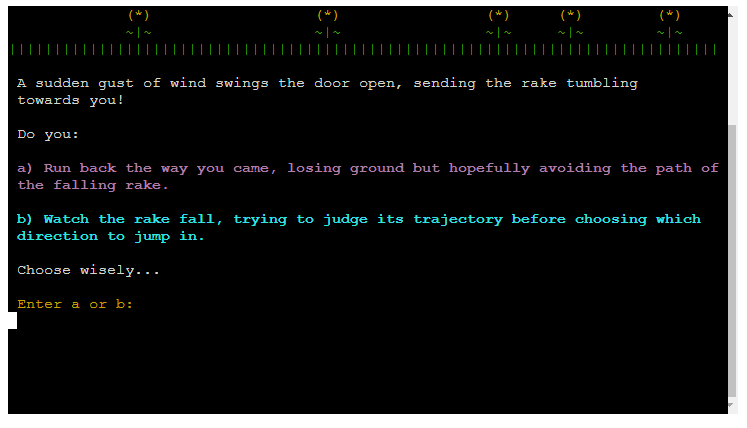

***Display Rake Story Choices***

- Two options are displayed for the player to choose from. Each option determines a different narrative direction for the next part of the story.
- The display_rake_story_choices() function extracts the two options (RAKE_OPTION_A and RAKE_OPTION_B) from story_text.py and displays them to the player.
- This function then runs the get_story_choice() function to ask the player to choose option a or b.
- An if/else statement defines which code to run and which narrative text variable to extract from story_text.py according to the choice of a or b made by the player.
-  Both outcomes run the rake_ascii() function from rake.py which displays the rake ascii art alongside the relevant narrative text for either a or b chosen by the player.
- For both option choices, the progress_prompt() function is imported from progress_prompt.py to ask the player to "Press enter to continue..." when they are ready.

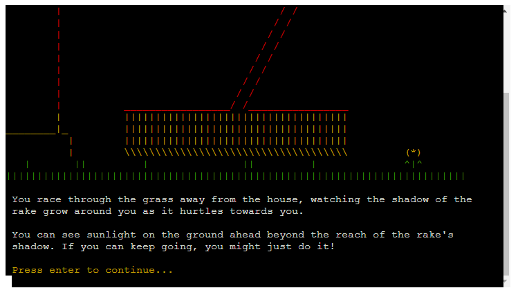

***Nested Rake Options***

- One of the two options in the first rake scenario contains a further set of 'nested' options for the player to choose from to progress the story.
- The display_nested_rake_choices() function extracts the NESTED_RAKE_OPTIONS_TEXT from story_text.py and displays this on the terminal along with the two nested options a and b for the player to select between.
- Options are displayed to the player in two different colours so they stand out from the usual story text.
- The progress_prompt() function is imported from progress_prompt.py to ask the player to "Press enter to continue..." when they are ready.

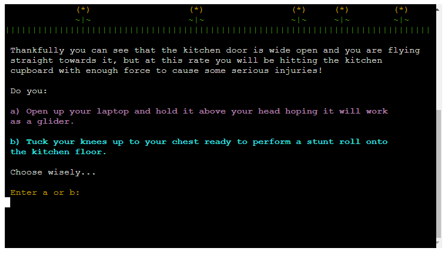

### Story Choice: input()

- Each time the player is presented with a choice of two options a or b in the narrative text, the get_story_choice() function prompts the player to make a selection from the two options and enter a or b.
- The entered choice is passed through validation function validate_story_choice() to check that they have entered either 'a' or 'b'. If it doesn't pass validation then an error message is displayed to the player with a prompt to try again.
- The error message is displayed in red text to highlight that there is problem that needs attention.

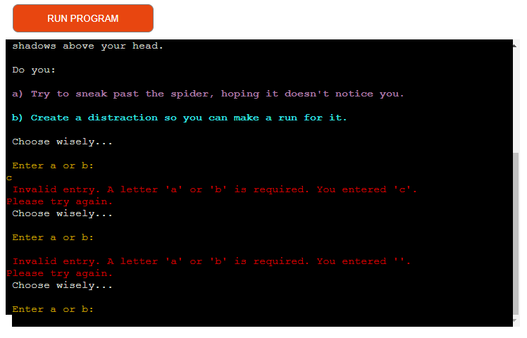
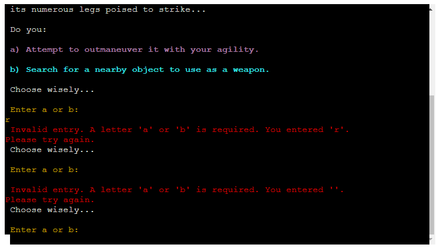

### Game Over

***Game Over Text***

- At several stages of the game, the player may choose an option that results in the game over for the player.
- The game_over() function displays the game_over_separator (a red version of the usual story_separator ascii art), along with the relevant game over narrative text and large text stating GAME OVER.
- The GAME OVER text is generated using [pyfiglet](https://pypi.org/project/pyfiglet/) in 'slant' font and red colour to echo the text that is used in the title text and reinforce the message that the player's character has died.
- This function runs the get_restart_choice() function to ask the player if they would like to start from the beginning again or end the game. 

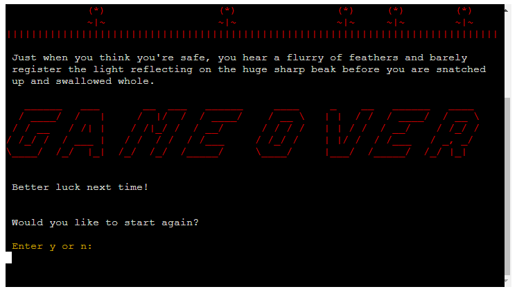

***Restart Game: input()***

- The get_restart_choice() function displays the message "Would you like to start again?" and asks the player to enter y or n to indcate their answer.
- The player input is validated through the validate_restart_choice() function to check that the player has entered 'y' or 'n'. If the value entered doesn't pass validation then an error message is displayed to the player with a prompt to try again.
- The error message is displayed in red text to highlith that there is a problem that needs attention.

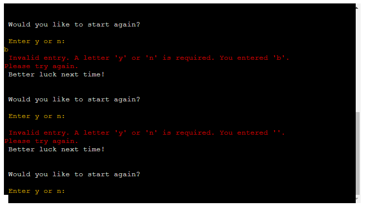

***End Credits***

- If the player chooses not to restart the game, then the game_over() function displays the end credits and exits the programme.
- Includes a message thanking the player for playing and including a link to the designer's LinkedIn profile.

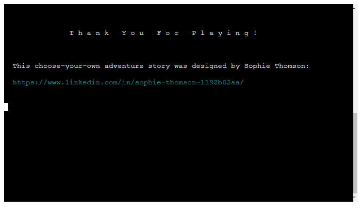

### Game Completion

***Congratulations Text***

- The last code to run in the main() function will only run if the player makes it all the way to the end of the game.
- This displays the narrative variable END_TEXT to finish the story and an f-string stating "Congratulations {player_name}!" which inserts the name chosen by the player in place of the {player_name} placeholder.
- The congratulations message is generated using [pyfiglet](https://pypi.org/project/pyfiglet/) in 'small' font and yellow colour to stand out and highlight that it is different to the other title and game over text styles.

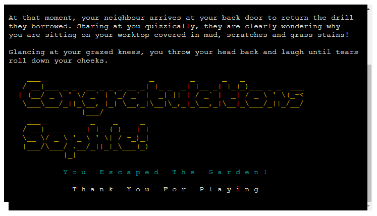

### Existing Features

- CRUD Functionality (Create, Read, Update, Delete)
- Error Handling
- Heroku Deployment
- All content written and presented to fit on window of 80 characters wide x 24 lines high.
- 

### Future Features
To expand on this project, there are a number of features that could be added to enhance player enjoyment and functionality:
- 
- The option to 
 
## Design

### Planning Process

***Story Writing***

- ChatGPT

***Logic Mapping***

- A flow diagram following the story narrative .

### Building in Python

***Process***

- Incremental Coding
- 

***Data Model***

- 

***List of Functions***

- get name and validation
- display story choices
- continue choice
- Separate py files

***Imported Libraries***

- pyfiglet
- 

***ASCII Art***

- Designed using raw print data
- Colorama
- Separate py files

### Layout and Styling

- All content written and presented to fit on window of 80 characters wide x 24 lines high.
- Consistent use of colours for repeating elements to improve user experience and readability:
    - White: Narrative text
    - Yellow: Call to attention for player to interact with game
    - Cyan and Magenta: Used to highlight story options to choose from
    - Red: Used to highlight important information such as error messages and main titles
- Story separator
- Game over separator

## Testing

### Logic Flow

***Method of Testing***

- 

***Results***

- 
- 

### Validation and Error Handling

- 
- 

### ASCII Art Loading

***Method of Testing***

- 

***Results***

- 

### Script Functionality

***Method of Testing***

- 

***Results***

- 
        
### Validator Testing

- PYTHON
    -  No errors were found when passing through the Pep8 Validator [CI Python Linter](https://pep8ci.herokuapp.com/)

- GitPod Problems
    - No problems detected within the Gitpod Garden-Escape workspace

### Unfixed Bugs

- On occassion there is some residual code from the title text or ascii art that is not cleared by the os.system("clear") function. This issue is inconsistent and does not affect the user experience as it is not visible unless the player chooses to scroll up on the terminal window. I have not been able to identify a reason for this issue, but as it does not impact the intended functionality and use of the program I have kept the title text and ascii art in the program.
- No other bugs.

## Deployment

### Gitpod Version Control
This site was created using the Gitpod cloud development environment before being pushed through to a dedicated repository on Github.

The following commands were used througout development to push the code through to the Github repo:

- **git add .** - This command was used to add any tracked files to the staging area.
- **git commit -m "Commit message."** - This command was used to create a snapshot of the staged area with a short description.
- **git push** - This command was used to push the committed changes from the current branch to the remote repository on Github.

### Deployment

The finished program was initially hosted within a repository on Github, and then this Github repository was connected with Heroku, the site through which the final project was deployed.

***How to Deploy to Heroku***

The steps to deploy to Heroku are as follows:

- 
- 
- 
- 

## Credits

### Content

***Data Model***

- [Portal Hunt](https://github.com/JackLamb99/portal-hunt/) by Jack Lamb was referred to as an example of how to structure the story narrative data (story_text.py) ready to be imported and used in run.py. 

No code was taken from Jack's project, but it was useful for considering a suitable data model. 

***Python***

- The CI walkthrough project 'Love Sandwiches' was used as a reference example when building the error handling functions; validate_player_name() and validate_story_choice()
- A tutorial on [YouTube ' How to create ASCII art text in Python'](https://youtu.be/Y0QiBbI3MWs) was used as guidance on how to import and use pyfiglet library to create the title and game over text
- Guidance on [Geeks for Geeks](https://www.geeksforgeeks.org/python-docstrings/) was used as reference for best practice when writing docstrings
- Guidance on [Python Morsels](https://www.pythonmorsels.com/breaking-long-lines-code-python/) was used as reference for breaking up long lines of code to fit within the 80 character constraints 
- A World Class Tech Ed tutorial on [YouTube](https://www.youtube.com/watch?v=z8yw9gUJaHo) was used as a reference when creating my own ASCII art
- Guidance on [Geeks for Geeks](https://www.geeksforgeeks.org/clear-screen-python/) was used as reference for how to clear the screen in python using os.system("clear")
- The code in a [StackOverflow discussion](https://stackoverflow.com/questions/1254370/reimport-a-module-while-interactive) was adapted to enable the title content to be re-imported if the player chooses to re-start the game.
- 
- 

## Code & Technology

 The following code, platforms and apps were used in the creation of this program:
 - Python - The program is written in Python code and is run within a Python Terminal.
 - [Stack Overflow](https://stackoverflow.com/) - used as a reference for possible syntax of Python code.
 - [Geek for Geeks](https://www.geeksforgeeks.org/) - used for guidance on best practice and syntax. 
 - [Gitpod](https://gitpod.io/) - Cloud development environment used to write and preview code before committing.
 - [Github](https://github.com/) - Github hosts the Garden Escape: Honey I Shrunk the Coder! repository and connects to Heroku where the site is deployed.
 - [Heroku](https://dashboard.heroku.com/apps) - a cloud-based Platform as a Service (PaaS) that Garden Escape is deployed through
 - [Lucidchart](https://www.lucidchart.com/pages/) - used to create flow diagram to map out program logic
 - [ChatGPT](https://chatgpt.com/) - used to generate initial ideas for narrative structure and what choose-your-own adventure options might look like
 - Google Docs - used to write out story narrative, building on some parts of the content provided by ChatGPT
 - [pyfiglet (PyPI)](https://pypi.org/project/pyfiglet/) - used to generate the ASCII Art text for the game title, game over and congratulations text
 - [Colorama (PyPI)](https://pypi.org/project/colorama/) - used to change colour of output within the Python terminal
 - Import of [os](https://docs.python.org/3/library/os.html) built-in operating system library - used for clear screen function to help with styling and readability
 - Import of [importlib](https://docs.python.org/3/library/importlib.html) built-in import implementation library - used to reimport function to enable player to re-start from the beginning of the game.

 ## CHEAT SHEET

 The order of correct choices to reach the end of the game without dying is as follows:

 - b, b, b, a

