# Garden Escape: Honey I Shrunk the Coder!

Garden Escape: Honey I Shrunk the Coder! is a fun choose-your-own adventure story game where you play the role of a tiny software developer who has to make a series of key decisions to choose the direction of the narrative and try to survive until the end of the story.

Can you fight your way through your jungle-sized garden, past giant creepy crawlies and garden tools back to the safety of your kitchen? Choose from the options presented to you as you progress through the story and follow the prompts on screen to see if you can make it home and escape the garden.

The story includes references that will appeal to developers, but is equally fun and easy to understand if you have no coding experience at all.

This terminal-based project is coded in Python and is designed to view on a laptop / desktop computer screen. It will not display correctly on a mobile.

The live site can be found here: https://garden-escape-185db543c454.herokuapp.com/

***CHEAT SHEET***

If you get stuck or wish to run through the story to reach the end to test the functionality then the sequence of correct choices is listed at the end of this document.

## Features

### Game Title (title.py)

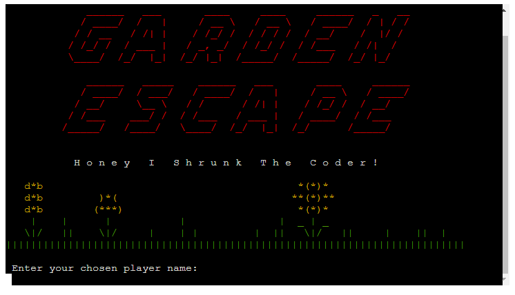

***Title Text***

- 'Garden Escape' displayed in large text to provide clear heading to mark the beginning of the story and to give an impression of a big adventure ahead. 
- Colour red used to indicate danger and risk
- 'Honey I Shrunk the Coder!' in default font, but with spacing between letters to stand out from regular text and appear larger to work visually alongside main title text.
- 'Garden Escape' text generated using [pyfiglet 1.0.2](https://pypi.org/project/pyfiglet/) library imported from Python Package Index (PyPI) with ['slant'](http://www.figlet.org/examples.html) font. 
- Red colour text output created using [Colorama 0.4.6](https://pypi.org/project/colorama/) library imported from PyPI.

***ASCII Art***

- A garden themed strip of ASCII art to help set the scene alongside the title text.
- Different coloured output created using Colorama’s constant shorthand for ANSI escape sequences.

***Enter Name: input()***

- The player is invited to enter a name for their story character via the get_player_name() function.
- The name must be at least 1 character long, but less than 16 characters so it fits in the final congratulations window at the end of the story.
- The entered name is passed through validation function validate_player_name() and if it does not pass validation then an error message is displayed to the player with a prompt to try again.
- The error message is displayed in red text to highlight that there is problem that needs attention.

### Introduction

***Good Luck Message***

- An f-string at the top of the intro page displays the message "Good Luck {player}!" which inserts the name entered by the user in place of the {player} placeholder. 
- Feeds back to the user that the name they entered has been logged and provides a more personal interaction with the game.

***Intro Text***

- Introductory text to set the scene for the story, providing context and explaining the aim of the game.
- The start_adventure() function displays the relevant block of narrative text from the story_text.py by drilling down using dot notation to the relevant variable INTRO_TEXT and extracting this content from the file to display in the terminal.

***Start Game: input()***

- At the bottom of the window is a prompt with an f-string displaying "Are you ready {player_name}? Press enter to continue..." which inserts the name entered by the user in place of the {player_name} placeholder.
- This reinforces the connection with the player and builds tension.
- There is no validation for this input as it is not used in any other part of the program

### CHAPTER ONE - Spider Story

***Spider Story and Options Text***

- Narrative text to start the adventure and set the scene for an encounter with a giant spider.
- The display_spider_story() function extracts the SPIDER_STORY_TEXT from story_text.py and displays it on the terminal.
- Two options are displayed for the player to choose from. Each option will determine a different narrative direction for the next part of the story.
- The display_spider_story() function extracts the two options (SPIDER_OPTION_A and SPIDER_OPTION_B) from story_text.py
- The options are displayed to the player in two different colours so they stand out from the usual story text.
- This function runs the display_spider_story_choices() function

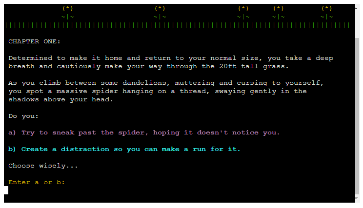

***Display Spider Story Choices***

- The display_spider_story_choices() function gets the story choice from the player and uses an if/else statement to define which code to run and narrative text to extract from story_text.py according to the choice of a or b made by the player.
-  Both outcomes will run the spider_ascii() function from spider.py which displays the spider ascii art alongside the relevant narrative text for either a or b chosen by the player.
- For both option choices, the progress_prompt() function is imported from progress_prompt.py to ask the player to "Press enter to continue..." when they are ready.
- This function allows the player to move through each 'page' of the story at their own pace and does not require any validation as the input is not used anywhere else.

***Nested Spider Options***

- One of the two options in the first spider scenario contains a further set of 'nested' options for the player to choose from to progress the story.
- The display_nested_spider_choices() function extracts the NESTED_SPIDER_OPTIONS_TEXT from story_text.py and displays this on the terminal along with the two nested options a and b for the player to select between.
- Options are displayed to the player in two different colours so they stand out from the usual story text.
- The progress_prompt() function is imported from progress_prompt.py to ask the player to "Press enter to continue..." when they are ready.

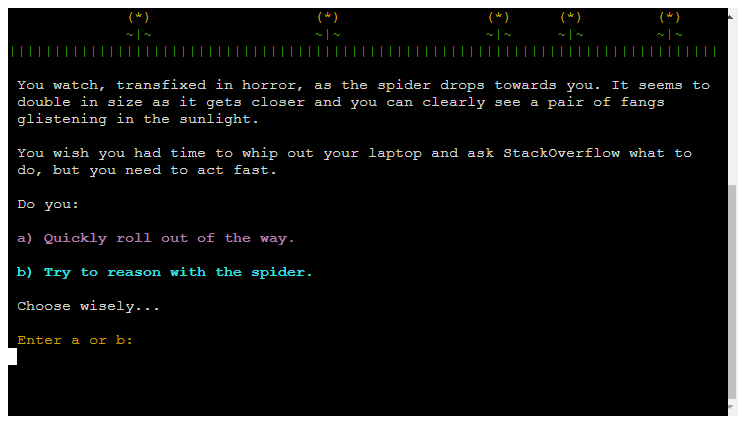

***Story Progress***

- If the player makes it through all of the spider related choices without dying, then the program moves on to the next line of code in the main() function and the next chapter is displayed. 

### CHAPTER TWO - Centipede Story

***Centipede Story Text***

- Narrative text to move the story forward from the spider scenario and set the scene for an encounter with an enormous centipede.
- The display_centipede_story() function extracts the CENTIPEDE_STORY_TEXT from story_text.py and displays it on the terminal.
- This function runs the display_centipede_story_choices() function.

***Display Centipede Story Choices***

- Two options are displayed for the player to choose from. Each option determines a different narrative direction for the next part of the story.
- The display_centipede_story_choices() function extracts the two options (CENTIPEDE_OPTION_A and CENTIPEDE_OPTION_B) from story_text.py and displays them to the player.
- This function then runs the get_story_choice() function to ask the player to choose option a or b.
- An if/else statement defines which code to run and which narrative text variable to extract from story_text.py according to the choice of a or b made by the player.
-  Both outcomes run the centipede_ascii() function from centipede.py which displays the centipede ascii art alongside the relevant narrative text for either a or b chosen by the player.
- For both option choices, the progress_prompt() function is imported from progress_prompt.py to ask the player to "Press enter to continue..." when they are ready.

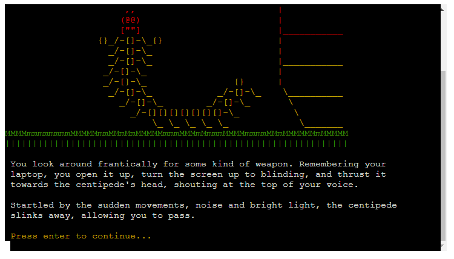

### Chapter Three - Rake Story

***Rake Story Text***

- Narrative text to move the story forward from the centipede scenario and set the scene for the next obstacle; a massive rake.
- The display_rake_story() function extracts the RAKE_STORY_TEXT from story_text.py and displays it on the terminal.
- This function runs the display_rake_story_choices() function.

***Display Rake Story Choices***

- Two options are displayed for the player to choose from. Each option determines a different narrative direction for the next part of the story.
- The display_rake_story_choices() function extracts the two options (RAKE_OPTION_A and RAKE_OPTION_B) from story_text.py and displays them to the player.
- This function then runs the get_story_choice() function to ask the player to choose option a or b.
- An if/else statement defines which code to run and which narrative text variable to extract from story_text.py according to the choice of a or b made by the player.
-  Both outcomes run the rake_ascii() function from rake.py which displays the rake ascii art alongside the relevant narrative text for either a or b chosen by the player.
- For both option choices, the progress_prompt() function is imported from progress_prompt.py to ask the player to "Press enter to continue..." when they are ready.

***Nested Rake Options***

- One of the two options in the first rake scenario contains a further set of 'nested' options for the player to choose from to progress the story.
- The display_nested_rake_choices() function extracts the NESTED_RAKE_OPTIONS_TEXT from story_text.py and displays this on the terminal along with the two nested options a and b for the player to select between.
- Options are displayed to the player in two different colours so they stand out from the usual story text and the player is promtped to enter their choice.

### Story Choice: input()

- Each time the player is presented with a choice of two options (a or b) in the narrative text, the get_story_choice() function prompts the player to make a selection from the two options and enter a letter 'a' or 'b'.
- The entered choice is passed through validation function validate_story_choice() to check that they have entered either 'a' or 'b'. If it doesn't pass validation then an error message is displayed to the player with a prompt to try again.
- The error message is displayed in red text to highlight that there is problem that needs attention.

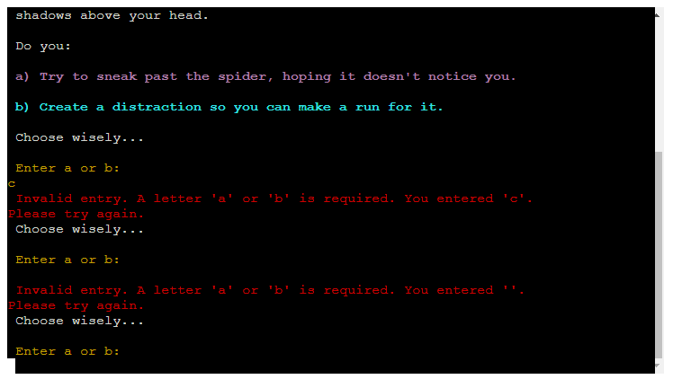

### Game Over

***Game Over Text***

- At several stages of the game, the player may choose an option that results in game over for the player.
- The game_over() function displays a red version of the story_separator art, along with the relevant game over narrative text and large text stating GAME OVER.
- The GAME OVER text is generated using [pyfiglet](https://pypi.org/project/pyfiglet/) in 'slant' font and red colour to echo the text that is used in the title text and reinforce the message that the player's character has died.
- This function runs the get_restart_choice() function to ask the player if they would like to start from the beginning again or end the game. 

***Restart Game: input()***

- The get_restart_choice() function displays the message "Would you like to start again?" and asks the player to enter y or n to indcate their answer.
- The player input is validated through the validate_restart_choice() function to check that the player has entered 'y' or 'n'. If the value entered doesn't pass validation then an error message is displayed to the player with a prompt to try again.
- The error message is displayed in red text to highlight that there is a problem that needs attention.

***End Credits***

- If the player chooses not to restart the game, then the game_over() function displays the end credits and exits the programme.
- Includes a message thanking the player for playing and including a link to the designer's LinkedIn profile.

### Game Completion

***Congratulations Text***

- The last code to run in the main() function will only run if the player makes it all the way to the end of the game.
- This displays the narrative variable END_TEXT to finish the story and an f-string stating "Congratulations {player_name}!" which inserts the name chosen by the player in place of the {player_name} placeholder.
- This gives the user a positive and personal feedback message that they have beaten the game.
- The congratulations message is generated using [pyfiglet](https://pypi.org/project/pyfiglet/) in 'small' font and yellow colour to stand out and highlight that it is different to the other title and game over text styles.

### Existing Features

- Robust Error Handling functions validate all player inputs where the input value is to be used in another part of the program and raise clear error messages to be displayed to the player if validation fails.
- This program is deployed and run on Heroku using a specially designed CI Python template. 
- All content written and presented to fit terminal window of 80 characters wide x 24 lines high.
- Elements of CRUD functionality (Create, Read, Update, Delete) are evident in the reading of different variables of text data from the story_text.py file, and ASCII Art code files which are read and diplayed on the terminal throughout the program.

### Future Features

To expand on this project, there are a number of features that could be added to enhance player enjoyment and functionality:
- Create a leaderboard for players to record the number of tries that it took them to complete the game
- An option for the player to add their own ending to the game which could replace the original version and be shared with other players.
- A progress bar could be added to let the player know how far through the game they got before they died.
- A feedback page could be linked from the terminal to ask players for their reviews of the game and any suggestions for improvement. 
 

## Design

### Planning Process

***Story Writing***

- ChatGPT was used initally to generate a range of different choose your own adventure stories about a software developer who had been shrunk and had to fight through a garden to survive getting past a spider, a centipede and a rake.
- Elements of some of these stories were then amalagamated together and fleshed out to become the story narrative which was then converted into the story_text.py as a list of specific narrative variables to be inserted at the appropriate point.

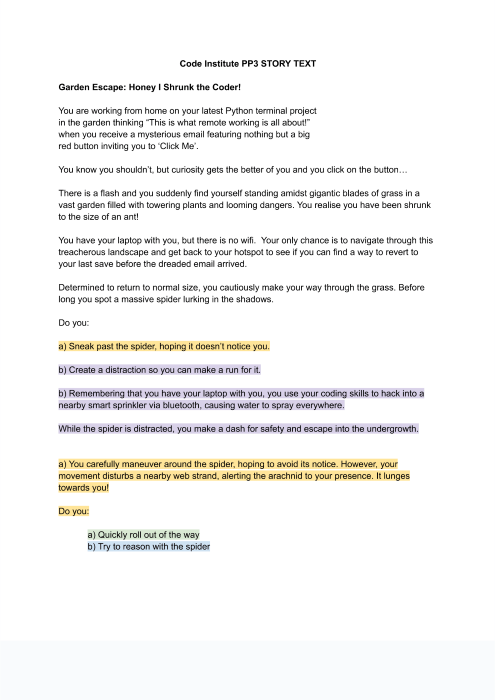
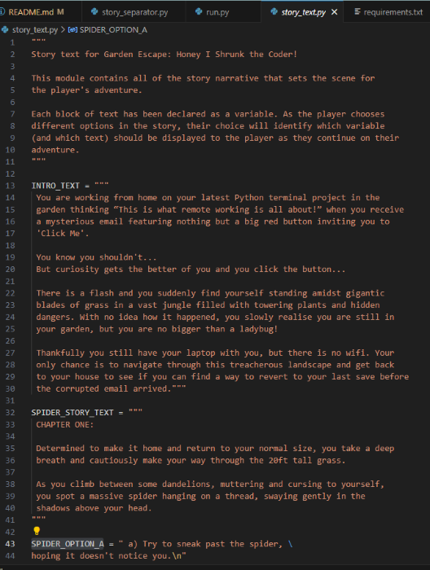

***Logic Mapping***

- A flow diagram to map out the logic for the entire game was created using [LucidChart](https://www.lucidchart.com/pages/).
- This provided a framework of the functionality required at each step of the program including:
    - User input points
    - Data validation requirements
    - if/else statement functions
    - Story narrative data requirements

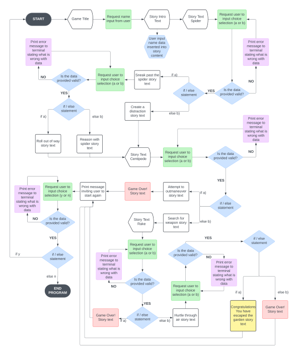

### Building in Python

***Process***

- The main body of the program was built using incremental coding to tackle each step outlined in the logic diagram. 
- Where there was repetition of the same process in each chapter, a global function was created such as the get_story_choice() function and the validate_story_choice() function.
- To prevent the main() function from getting too long, local level functions are called from within the associated function that requires that function to run.   

***Data Model***

- To prevent the run.py file getting too large and difficult to read, all of the narrative data is in a separate story_text.py file and the relevant variables are read and displayed as required.
- Each block of narrative text is defined as a variable with a relevant capitalised name to indicate that it is constant and should not be changed.
- Functions that are repeated throughout the program are in separate .py files and imported as necessary such as:
    - story_separator() to display a strip of ascii art as a form of 'page break' 
    - progress_prompt() to ask the player to press Enter to continue

***List of Functions***

The functions created for this program are listed below. A detailed description of the functionality can be found in the docstring for each function:  

- main()
- get_player_name()
- validate_player_name()
- start_adventure()
- story_separator()
- get_story_choice()
- validate_story_choice()
- display_spider_story()
- display_spider_story_choices()
- display_nested_spider_choices()
- spider_ascii()
- display_centipede_story()
- display_centipede_story_choices()
- centipede_ascii()
- display_rake_story()
- display_rake_story_choices()
- display_nested_rake_choices()
- rake_ascii()
- game_over_separator()
- game_over()
- get_restart_choice()
- validate_restart_choice()
- progress_prompt()

***Imported Libraries***

- pyfiglet (PyPI) - used to generate ASCII text
- Colorama (PyPI) - used to create coloured output for better readability and visual interest
- importlib - importlib.reload() function used to reload game title if player restarts the game 
- os - os.system("clear") function used to clear the window
- webbrowser - used to open link to LinkedIn profile when end credits are displayed

***ASCII Art***

- All ASCII art files were designed by Sophie Thomson using a raw string print function.
- Different coloured outputs to add visual interest were used by importing Colorama library
- The ASCII Art for the creature or tool in each chapter was created as a function in a separate py file so it could be called and displayed multiple times within without issue.
- The story_separator() function was created using a strip of ASCII Art as a form of 'page break' for better demarcation between story 'pages' and improved readability
- A red version of the story separator is used in the game_over() function to reinforce the GAME OVER message and that the player's character has died.

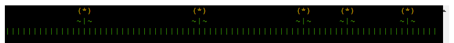

### Layout and Styling

- All content is written and presented to fit on window of 80 characters wide x 24 lines high.
- Consistent use of colours for repeating elements to improve user experience and readability:
    - White: Narrative text
    - Yellow: Call to attention for player to interact with game
    - Cyan and Magenta: Used to highlight story options to choose from
    - Red: Used to highlight important information such as error messages and main titles
- Story separator
- Game over separator

## Testing

### Testing Areas

***End-to-End Logic***

When testing the logical flow of the program the following aspects have been tested:

- That the program follows the logic sequences laid out in the logic flow diagram from start to finish.
- That there are no logic 'loops' for the player to get stuck without progressing through the story.
- That each story line starts and finishes at the expected outcome by following the correct steps.

***Python Functionality***

When testing the Python functionality of the program the following aspects have been tested:

- That the correct story narrative and story options are displaying in the right places.
- That the correct ASCII art is displayed in the right places.
- That all user input functions are running at the appropriate points with expected interaction prompts displayed to the player.
- That all interaction input from the player is processed correctly and triggers the expected outcome.
- That the game play functions run smoothly with no errors from start to finish.
- That all text is displaying correctly with no errors.
- That all text is readable and the coloured output is as expected.
- That clear instruction is given to the player at each stage of the game.
- That the end credits whether you complete the game or have game over trigger the correct link in an external tab.

***Validation and Error Handling***

When testing the validation and Error Handling within the program the following aspects have been tested:

- That all player input is checked against the correct parameters via the appropriate validation function.
- That ValueError messages are triggered if the player enters any value that is not the requested input.
- That all ValueError messages are clear and concise providing clear instructions to the player.
- That all ValueError messages are displayed in red text to highlight importance.
- That all while loops used within the relevant input functions are working as expected, prompting the player to re-enter their input until it has passed validation.

### Method

- Walk through every possible story line separately following the logic path laid out in the logic flow diagram
- At each step, check the aspects listed above for end-to-end logic, python functionality and validation and error handling.
- Mark in the results table to confirm that all aspects in each section are:
    - Running as expected
    - Show no errors
    - Run smoothly

### RESULTS

- The results are listed in the tables below under the following headings:
    - **Logic** - Testing all aspects of end-to-end logic listed above
    - **Functionality** - Testing all aspects of code functionality as listed above
    - **Validation** - Testing all Error Handling mechanisms are working and appropriate
- The results for each different possible storyline are recorded in a separate table. 
- The **Choice** column shows the option choice that the story has followed at that stage of the storyline.

- Storyline 1:

    | **Storyline Sequence** | **Choice** | **Logic** | **Functionality**  | **Validation**     |
    |:---                    |    :---:   |   :---:   |       :---:        |       :---:        |
    |Game Title              |-           |As Expected|Correct             |n/a                 |
    |Enter Name              |-           |As Expected|Correct with prompt |name val working    |
    |Story Intro Text        |-           |As Expected|Correct with prompt |Enter to cont.      |
    |Chapter 1: Spider       |a           |As Expected|Correct with prompt |a or b val working  |
    |Sneak Past              |-           |As Expected|Correct with prompt |Enter to cont.      |
    |Nested Spider Options   |a           |As Expected|Correct with prompt |a or b val working  |
    |Roll out of way         |-           |As Expected|Correct with prompt |Enter to cont.      |
    |Chapter 2: Centipede    |-           |As Expected|Correct with prompt |Enter to cont.      |
    |Centipede Options       |a           |As Expected|Correct with prompt |a or b val working  |
    |Attempt to outmanoeuver |-           |As Expected|Correct with prompt |Enter to cont.      |
    |Game Over               |y           |As Expected|Correct with prompt |y or n val working  |
    |Restart - Game Title    |-           |As Expected|Correct             |n/a                 |

- Storyline 1b - as above with 'n' selected as restart choice:

    | **Storyline Sequence** | **Choice** | **Logic** | **Functionality**  | **Validation**     |
    |:---                    |    :---:   |   :---:   |       :---:        |       :---:        |
    |                        |            |           |                    |                    |
    |Game Over               |n           |As Expected|Correct with prompt |y or n val working  |
    |End Credits             |-           |As Expected|Link not live       |n/a                 |

- Storyline 2:

    | **Storyline Sequence** | **Choice** | **Logic** | **Functionality**  | **Validation**     |
    |:---                    |    :---:   |   :---:   |       :---:        |       :---:        |
    |Game Title              |-           |As Expected|Correct             |n/a                 |
    |Enter Name              |-           |As Expected|Correct with prompt |name val working    |
    |Story Intro Text        |-           |As Expected|Correct with prompt |Enter to cont.      |
    |Chapter 1: Spider       |a           |As Expected|Correct with prompt |a or b val working  |
    |Sneak Past              |-           |As Expected|Correct with prompt |Enter to cont.      |
    |Nested Spider Options   |b           |As Expected|Correct with prompt |a or b val working  |
    |Reason with Spider      |-           |As Expected|Correct with prompt |Enter to cont.      |
    |Chapter 2: Centipede    |-           |As Expected|Correct with prompt |Enter to cont.      |
    |Centipede Options       |b           |As Expected|Correct with prompt |a or b val working  |
    |Search for Weapon       |-           |As Expected|Correct with prompt |Enter to cont.      |
    |Chapter 3: Rake         |-           |As Expected|Correct with prompt |Enter to cont.      |
    |Rake Options            |a           |As Expected|Correct with prompt |a or b val working  |
    |Run Away                |-           |As Expected|Correct with prompt |Enter to cont.      |
    |Game Over               |y           |As Expected|Correct with prompt |y or n val working  |
    |Restart - Game Title    |-           |As Expected|Correct             |n/a                 |

- Storyline 2b - as above with 'n' selected as restart choice:

    | **Storyline Sequence** | **Choice** | **Logic** | **Functionality**  | **Validation**     |
    |:---                    |    :---:   |   :---:   |       :---:        |       :---:        |
    |                        |            |           |                    |                    |
    |Game Over               |n           |As Expected|Correct with prompt |y or n val working  |
    |End Credits             |-           |As Expected|Link not live       |n/a                 |

- Storyline 3:

    | **Storyline Sequence** | **Choice** | **Logic** | **Functionality**  | **Validation**     |
    |:---                    |    :---:   |   :---:   |       :---:        |       :---:        |
    |Game Title              |-           |As Expected|Correct             |n/a                 |
    |Enter Name              |-           |As Expected|Correct with prompt |name val working    |
    |Story Intro Text        |-           |As Expected|Correct with prompt |Enter to cont.      |
    |Chapter 1: Spider       |b           |As Expected|Correct with prompt |a or b val working  |
    |Create Distraction      |-           |As Expected|Correct with prompt |Enter to cont.      |
    |Chapter 2: Centipede    |-           |As Expected|Correct with prompt |Enter to cont.      |
    |Centipede Options       |b           |As Expected|Correct with prompt |a or b val working  |
    |Search for Weapon       |-           |As Expected|Correct with prompt |Enter to cont.      |
    |Chapter 3: Rake         |-           |As Expected|Correct with prompt |Enter to cont.      |
    |Rake Options            |b           |As Expected|Correct with prompt |a or b val working  |
    |Hurtle Through Air      |-           |As Expected|Correct with prompt |Enter to cont.      |
    |Nested Rake Options     |a           |As Expected|Correct with prompt |a or b val working  |
    |Glide Using Laptop      |-           |As Expected|Correct with prompt |Enter to cont.      |
    |Congratulations!        |

***Screenshots of ValueError messages***

### Validator Testing

- This program is written in Python only
    -  No errors were found when passing through the Pep8 Validator [CI Python Linter](https://pep8ci.herokuapp.com/)

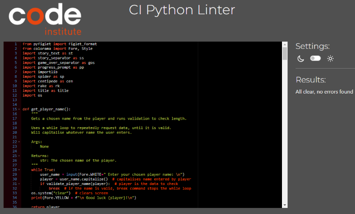
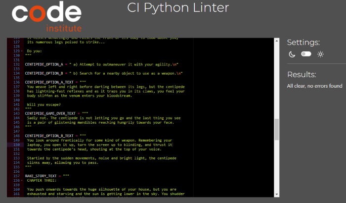
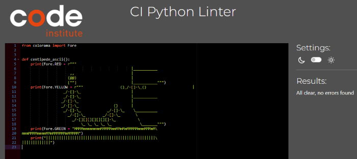
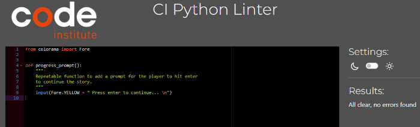
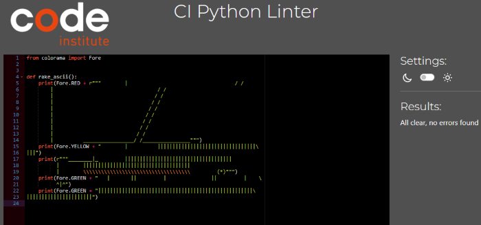
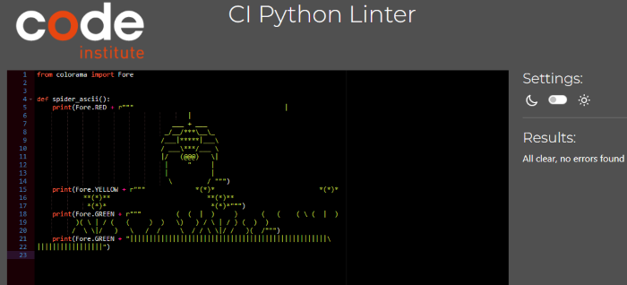
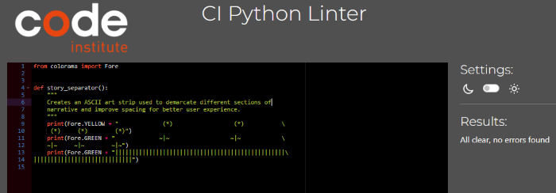
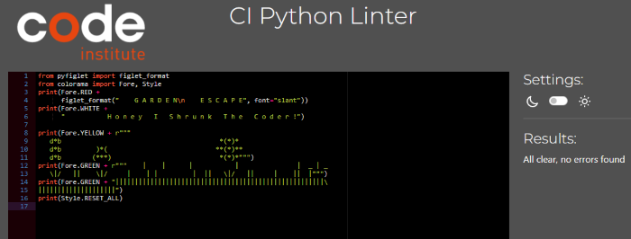

- GitPod Problems
    - No problems were detected within the Gitpod Garden-Escape workspace

### Unfixed Bugs

- On occassion there is some residual code from the title text or ascii art that is not cleared by the os.system("clear") function. This issue is inconsistent and does not affect the user experience as it is not visible unless the player chooses to scroll up on the terminal window. I have not been able to identify the reason for this issue, but as it does not impact the intended functionality and use of the program I have kept the title text and ascii art in the program.
- No other bugs.

## Deployment

### Gitpod Version Control
This site was created using the Gitpod cloud development environment before being pushed through to a dedicated repository on Github.

The following commands were used througout development to push the code through to the Github repo:

- **git add .** - This command was used to add any tracked files to the staging area.
- **git commit -m "Commit message."** - This command was used to create a snapshot of the staged area with a short description.
- **git push** - This command was used to push the committed changes from the current branch to the remote repository on Github.

### Deployment

The finished program was initially hosted within a repository on Github, and then this Github repository was connected with Heroku, the site through which the program is deployed.

***How to Deploy to Heroku***

The steps to deploy to Heroku are as follows:

- Ensure that you have a file in your program file directory called: requirements.txt 
- Ensure that all imported libraries that are used in your program are listed in the requirements.txt file.
    - To add any new libraries, type the following command into the terminal: pip3 freeze > requirements.txt
- To avoid errors, ensure that there is a \n (new line) at the end of every input function in your code.
- Use **git add .** then **git commit -m "Commit message."** and then **git push** to push all latest changes into the relevant repository on Github.
- Go to the [Heroku Website](https://dashboard.heroku.com/) and log in by clicking on the link in the top right corner of the screen.
    - Sign up for a new Heroku account if needed. 
    - Please note you will need to add a payment card before Heroku will allow you to deploy any project. 
    - To do this you will need to click on your account profile in the top right corner and click on Account Settings, then select the Billing tab and follow the instructions to add a credit card. 
- Once logged in, click on the **'New'** drop down menu at the top of your dashboard and select **'Create new app'**
- Choose a name for your app ideally using the same conventions as your project name in your Github repository
- Select the region that you are located in from the options shown
- Ignore the Add to pipeline... button and click on **'Create app'**
- Select the **'Settings'** tab at the top of the screen and scroll to the Config Vars section
- Click on **'Reveal Config Vars'** and if you have a file with confidetial information such as a CREDS.json file type 'CREDS' in the 'key' field and then copy the entire contents of your CREDS.json file and paste it all into the 'Value' field before clicking on **'Add'**.
- Repeat the above process to add a second Config Var and type 'PORT' in the 'Key' field and type '8000' in the 'Value' field before clicking on **'Add'**
- Scroll down to the Buildpacks section and click on **'Add buildpack'**, then select 'Python' from the menu and click on **'Add'**.
- Repeat the above process to add a second buildpack. This time select 'nodejs' from the menu and click on **'Add'**.
- Check that both buildpacks are listed and that Python is positioned on top, with nodejs listed underneath.
- Scroll back to the top of the page and click on the 'Deploy' tab.
- In the Deployment Method section, select Github and confirm that you want to connect to Github.
- In the 'Search for a repository to connect to' type in the name of the repository that you want to deploy and click **'Search'**.
- Click on the **'Connect'** button next to the correct Github repository in the search results
- Scroll down to select whether you would like to deploy automatically (Heroku will build a new app every time you push new updates through to the Github repository), or whether you would like to deploy manually at less regular intervals when you wish to check or test something.
- Click on either **'Enable Automatic Deploys'** to update automatically, or on **'Deploy Branch'** (ensure that the branch selected is 'main') to deploy manually when you want to.
- Heroku will build your app and will then display a 'View' button at the bottom of the screen.
- Click **'View'** to see your deployed project!  

## Credits

### Content

***Data Model***

- [Portal Hunt](https://github.com/JackLamb99/portal-hunt/) by Jack Lamb was referred to as an example of how to structure story narrative data to be imported and read in run.py. 

No code was taken from Jack's project, but it was useful for considering a suitable data model. 

***Python***

- The CI walkthrough project 'Love Sandwiches' was used as a reference example when building the error handling functions; validate_player_name() and validate_story_choice()
- A tutorial on [YouTube ' How to create ASCII art text in Python'](https://youtu.be/Y0QiBbI3MWs) was used as guidance on how to import and use pyfiglet library to create the title and game over text
- Guidance on [Geeks for Geeks](https://www.geeksforgeeks.org/python-docstrings/) was used as reference for best practice when writing docstrings
- Guidance on [Python Morsels](https://www.pythonmorsels.com/breaking-long-lines-code-python/) was used as reference for breaking up long lines of code to fit within the 80 character constraints 
- A World Class Tech Ed tutorial on [YouTube](https://www.youtube.com/watch?v=z8yw9gUJaHo) was used as a reference when creating my own ASCII art
- Guidance on [Geeks for Geeks](https://www.geeksforgeeks.org/clear-screen-python/) was used as reference for how to clear the screen in python using os.system("clear")
- The code in a [StackOverflow discussion](https://stackoverflow.com/questions/1254370/reimport-a-module-while-interactive) was adapted to enable the title content to be re-imported if the player chooses to re-start the game.
- A [StackOverflow discussion](https://stackoverflow.com/questions/66134751/how-do-i-properly-print-ascii-art) was used as a reference for formatting ASCII art to print correctly.

## Code & Technology

 The following code, platforms and apps were used in the creation of this program:
 - Python - The program is written in Python code and is run within a Python Terminal.
 - [Stack Overflow](https://stackoverflow.com/) - used as a reference for possible syntax of Python code.
 - [Geek for Geeks](https://www.geeksforgeeks.org/) - used for guidance on best practice and syntax. 
 - [Gitpod](https://gitpod.io/) - Cloud development environment used to write and preview code before committing.
 - [Github](https://github.com/) - Github hosts the Garden Escape: Honey I Shrunk the Coder! repository and connects to Heroku where the site is deployed.
 - [Heroku](https://dashboard.heroku.com/apps) - a cloud-based Platform as a Service (PaaS) that Garden Escape is deployed through
 - [Lucidchart](https://www.lucidchart.com/pages/) - used to create flow diagram to map out program logic
 - [ChatGPT](https://chatgpt.com/) - used to generate initial ideas for narrative structure and what choose-your-own adventure options might look like
 - Google Docs - used to write out story narrative, building on some parts of the content provided by ChatGPT
 - [pyfiglet (PyPI)](https://pypi.org/project/pyfiglet/) - used to generate the ASCII Art text for the game title, game over and congratulations text
 - [Colorama (PyPI)](https://pypi.org/project/colorama/) - used to change colour of output within the Python terminal
 - Import of [os](https://docs.python.org/3/library/os.html) built-in operating system library - used for clear screen function to help with styling and readability
 - Import of [importlib](https://docs.python.org/3/library/importlib.html) built-in import implementation library - used to reimport function to enable player to re-start from the beginning of the game.

 ## CHEAT SHEET

 The order of correct choices to reach the end of the game without dying is as follows:

 - b, b, b, a
